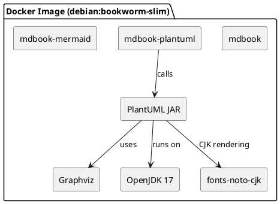
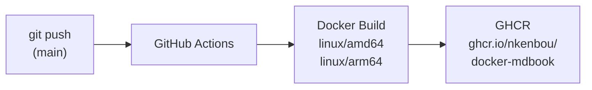

# 要件定義

<div class="toc-inline">

<!-- toc -->

</div>

## 概要

mdBook をビルドするための Docker イメージを作成する。
PlantUML はネットワーク越しの使用を避け、コンテナ内でローカル実行する。

## 使用ツール

| ツール | リポジトリ |
|---|---|
| mdBook | https://github.com/rust-lang/mdBook |
| mdbook-plantuml | https://github.com/sytsereitsma/mdbook-plantuml |
| mdbook-mermaid | https://github.com/badboy/mdbook-mermaid |
| PlantUML | https://github.com/plantuml/plantuml |

### イメージ内ツール構成



## 機能要件

### コンテナの使い方

`mdbook` を ENTRYPOINT に設定し、サブコマンドとして渡す形式で使用する。

```sh
docker container run ... [イメージ名] build
docker container run ... [イメージ名] serve
docker container run ... [イメージ名] watch
```

### ソースファイルの入出力

ボリュームマウントでソースディレクトリをコンテナに渡す。

```sh
docker container run -v $(pwd):/book -w /book [イメージ名] build
```

### PlantUML のローカル実行

PlantUML をコンテナ内でローカル実行し、外部サーバーへのネットワーク通信を行わない。

## バージョン管理

- 全ツール（mdBook、mdbook-plantuml、mdbook-mermaid、PlantUML）のバージョンを Dockerfile の `ARG` で固定する
- バージョンを更新したいときは `ARG` の値を書き換えてイメージを作り直す

## ホスティング・CI/CD

- Dockerfile などのソースは GitHub リポジトリで管理する
- ビルド済みイメージは GHCR（GitHub Container Registry）で公開する
- `main` ブランチへのプッシュ時に GitHub Actions でイメージを自動ビルド・プッシュする

### CI/CD フロー


